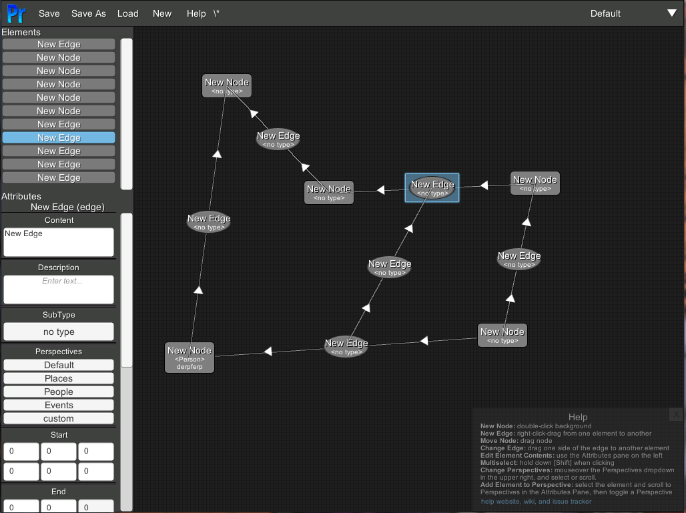

# Perspectives Story Graph Editor

A graph editor designed for narratives.

Perspectives is a node-based graph editor intended to help you design, write, understand, and analyze narratives, from movies to books to comics to role-playing games.

## Get Perspectives
[Download Perspectives Here](https://github.com/arcandio/Perspectives/releases)

## Development

[Help is available here.](https://github.com/arcandio/Perspectives/wiki)

Check out the [development notes here](dev.md), or the [current milestone](https://github.com/arcandio/Perspectives/milestones/Beta).

[Propose features and report bugs here.](https://github.com/arcandio/Perspectives/issues)

## Donations
And Lastly, if you like Perspectives, please consider donating bitcoin: `12AisCShNXkULSsSYdExBGdCSh5jM5hZzV`

Or you can use the [Coinbase Page](https://www.coinbase.com/Voidspiral)